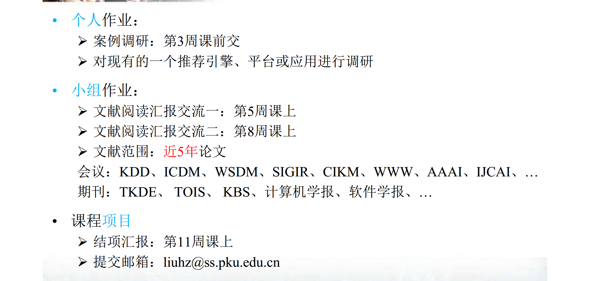

# 北京大学软件与微电子学院《推荐系统技术》课程作业

## 作业内容

----

## 任务安排

###  1.算法实现

>  说明：
>
>  a. 每组从下面的列表选一个算法，并在群里接龙以避免重复，例：“1. 张三 组 选算法3 WR-MF； 2. 李四组 选算法6 RSTE；...”；
>
>  b. **第5次课**前，提交两个版本的代码：（1）基于普通python3的版本（自己实线优化算法）；（2）基于TensorFlow的版本；
>
>  c. 做好算法设计，并给出设计文档，至少包含6个函数：（1）数据集的拆分（训练/验证/测试）；（2）数据加载；（3）模型训练（参数学习）；（4）模型（参数）保存；（5）模型（参数）加载；（6）模型测试或评估
>
>  d. 代码中应该有足够多的注释以便于阅读和理解。

贝叶斯个性化排序（BPR，Bayesian Personalized Ranking）

原始论文：[BPR: Bayesian Personalized Ranking from Implicit Feedback](https://arxiv.org/abs/1205.2618)

- BPR Python版  （3.16，第四周周六晚）：王胜广
- BPR tensorflow版 （3.16，第四周周六晚）：龚润宇、梅楚鹤
- BPR算法设计文档 （3.16，第四周周六晚）：龚润宇、梅楚鹤

### 2.论文阅读
原始论文：[Wide & Deep Learning for Recommender Systems](https://arxiv.org/abs/1606.07792)

- Wide&Deep论文翻译 （3.16，第四周周六晚）：柳俊志、尹国健
- 论文算法实现  （3.23，第五周周六晚）：王胜广
- 汇报PPT制作 （3.23，第五周周六晚）：王胜广
- 上台汇报（4.7，第六周周日课堂）：王胜广

### 3.课程项目

    11周提交，下周（9周）课前提交题目
    
    1.工程：找一个应用场景，新场景（非MovieLens等已有公开数据集），
    非热门领域（非商品视频新闻推荐，比如教育领域、新闻领域等），主要解决当前领域推荐需求，
    需要做出实用产品，最好使用自己小组汇报过的算法，训练数据集没有可以自己生成，主要是要能解决当前实际场景问题
    2.研究：改进现有算法问题，实现新算法
    3.综述：针对某一专题PPT的算法整理出一个章节，系统化梳理细化之
    

下次课前（4月21日前）各组选定课程项目题目，并在群里发布，以避免重复。
选题范围（三选一）：
1. 推荐系统应用：发掘某个行业（或应用)痛点，设计基于推荐的接近方案；
要求：完成后台的设计与实现；
2. 算法改进：针对选定的一个（或一类）最近的算法，提出改进方案，并进行测试验证；
3. 经典算法整理：选择某次课件，整理并补充完善，形成文字；
要求：可作为教材的一章
    

##  目录说明     
├── docs  //详细说明文档     
├── logs  //日志文件目录       
├── recommendation //推荐系统主体 ；详细说明见recommendation/READEME.md                                
│   ├── algorithms  //推荐算法              
│   ├── dao  //数据库相关                     
│   ├── main  //flask蓝图,提供web服务          
│   │   └── views.py  //http视图路由                             
├── tests  //单元测试  
├── config.py  //配置文件    
├── local_config.py  //本地配置文件  
├── manage.py  //入口文件    
├── README.md  //说明文档   
├── requirements.txt  //依赖包   
├── server.py  //服务启动     
├── recommendation_algorithms.py  //前两次作业        
│   ├── bpr  //贝叶斯个性化排序      
│   └──  wide_and_deep  //Wide&Deep模型      
